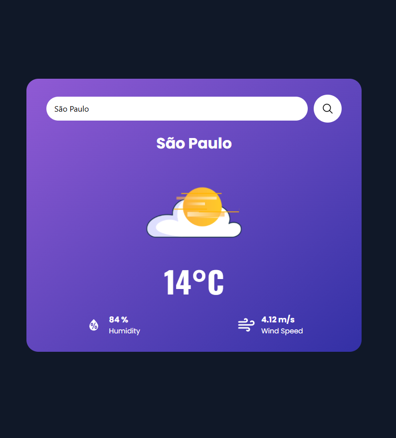
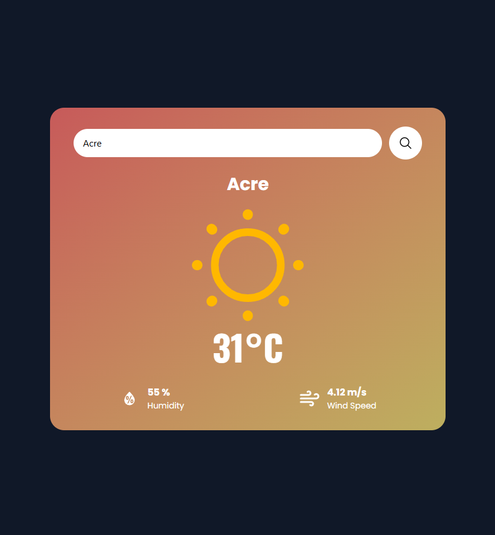
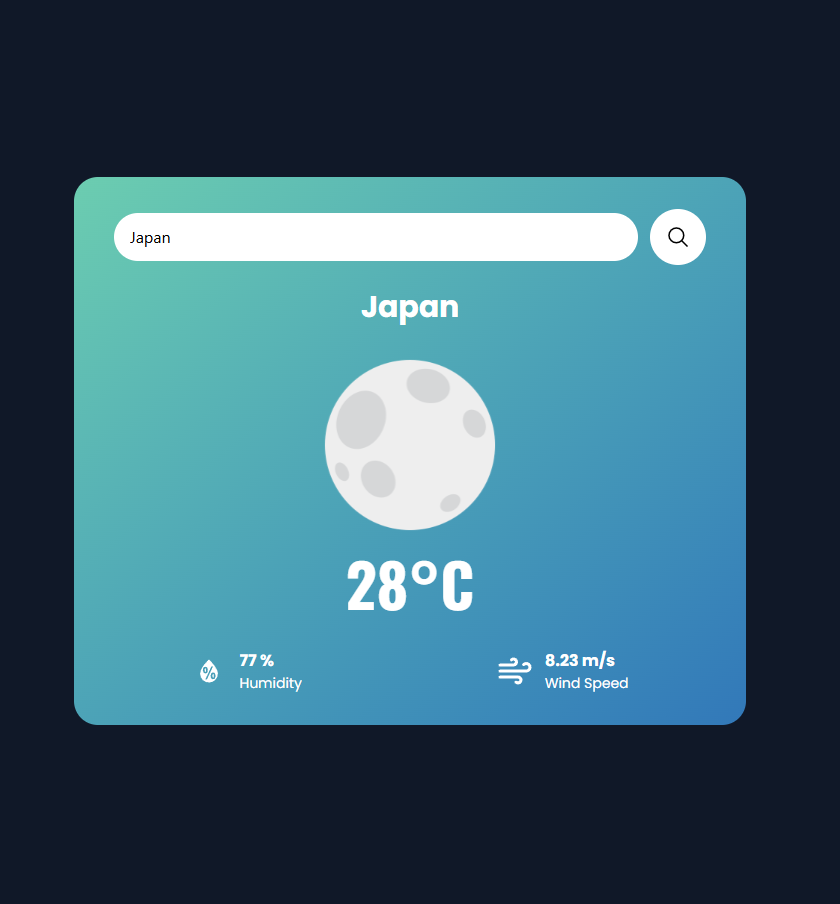

# WeatherCard — Clima Atual Dinâmico

WeatherCard é um projeto em React + TypeScript + Vite com TailwindCSS que exibe o clima atual de qualquer cidade usando a API do OpenWeather. O card altera ícones e cores com base na temperatura e no horário (dia/noite).

## Funcionalidades

- Pesquisa de clima por cidade.
- Exibição de:
  - Temperatura (°C)
  - Umidade (%)
  - Velocidade do vento (m/s)
  - Nome da cidade
  - Ícone do clima (sol, nuvem com sol ou lua)
- Gradiente do card muda dinamicamente conforme clima e horário.
- Tratamento de erro para cidade não encontrada.
- Design responsivo com TailwindCSS.

## Tecnologias

- React
- TypeScript
- TailwindCSS
- Vite
- API do OpenWeather

## UI / Design

Baseado no template gratuito do Figma "Weather Cards" ([https://www.figma.com/community/file/1322941160355481728/weather-cards](https://www.figma.com/community/file/1322941160355481728/weather-cards)).

## Como rodar localmente

1. Clone o repositório:

```bash
git clone https://github.com/jotalucasfarias/weathercard.git
cd weathercard
```

2. Instale dependências:

```bash
npm install
```

3. Crie um arquivo `.env` na raiz e adicione sua chave da API do OpenWeather:

```env
VITE_API_KEY=sua_chave_aqui
```

> Após alterar/criar o arquivo `.env` ou `.env.local`, reinicie o servidor de desenvolvimento (npm run dev) para que o Vite carregue a nova variável de ambiente.

4. Inicie o servidor de desenvolvimento:

```bash
npm run dev
```

5. Abra no navegador (geralmente em http://localhost:5173).

## Estrutura do projeto

```
src/
├── assets/         # SVGs do clima (sol, nuvem-sol, lua)
├── components/
│   └── WeatherCard.tsx
├── App.tsx
└── main.tsx
```

## Uso

Digite o nome de uma cidade no campo de busca e pressione "Buscar". O card exibirá:

- Nome da cidade
- Temperatura em °C
- Umidade (%)
- Velocidade do vento (m/s)
- Ícone correspondente (sol / nuvem com sol / lua)

O gradiente do card muda conforme a temperatura e o horário:

- Sol: gradiente vermelho/amarelo
- Nuvem com sol: gradiente roxo
- Lua (noite): gradiente azul/esverdeado

## Screenshots

As imagens estão na pasta public. Elas podem ser exibidas assim:







## Contribuição

Pull requests são bem-vindos. Para mudanças grandes, abra uma issue primeiro para discutir o que pretende alterar.

## Autor

- João Lucas Farias da Silva
- Email: jotalucasfarias@gmail.com
